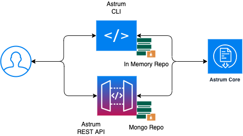

**Astrum**

A flexible JSON/YAML linter for creating automated style guides, with baked in support for OpenAPI v2 &amp; v3.

**OpenAPI** is now a widely-adopted method for describing web APIs. With that fact comes the pressure to validate these specifications are up to date, accurately constructed, and presented for optimal developer usage.

Especially with the shift from OpenAPI v2 to v3, developers may require further assistance to ensure their specification matches the current v3 structure and format. Thankfully, **Astrum** allows developers to lint their API specification against **OpenAPI v3 & v2** as well as best practices and **custom rules**.

🎁 **Features**

- An easy to use customisable **OpenAPI** linter which performs linting based on the linting rules configured.
- Supports **OASv2.x** and **OASv3.0** Open API Specifications.
- Supports both **JSON** and **YAML** formats.
- **Ready-to-use Functions:** Built-in set of functions to help create custom rules. 
- **Custom Functions**: Create custom functions for advanced use cases.
- Provides detailed information on the linting along with the line numbers at which the linting rules are applied on the open specification file.

## ⌛ Overview

- [Architecture](#architecture)
- [Usage](#usage)
- [astrum-cli](#astrum-cli)
- [astrum-api](#astrum-api)
- [Support](#support)
- [License](#license)

## ⚙️ Architecture

Astrum is entirely built on Java and consists of three modules,

- astrum-core
    - The module contains the core logic responsible for linting the OAS file.
-  astrum-api
    - Provides an Rest API to store the linting rules which will be used to lint the OAS specification.
- astrum-cli
    - The astrum-cli can be used as a command-line interface which takes up a OAS specification file and runs linting rules on it.

## 🪝 Usage

**Pre-Requisite**

- JRE 11+ is required in the target machine. Steps to [install](https://docs.oracle.com/goldengate/1212/gg-winux/GDRAD/java.htm#BGBFHBEA)
- Install [Maven](https://maven.apache.org/index.html)
- Checkout the astrum code from the [repository](https://github.com/apiwizlabs/astrum) to local machine
- Build the astrum modules. Navigate to the folder, **astrum** and run the below command
  
  > mvn clean install

This builds all the three modules of astrum in the target machine.

## 🧰 astrum-cli

Once the modules are built successfully, the astrum-cli component will be created as `astrum-cli-0.0.1-SNAPSHOT.jar` in the target directory. Go to the directory `astrum-cli/target` and run the below command to see the options supported by **astrum-cli**.

> java -jar astrum-cli-0.0.1-SNAPSHOT.jar

This will output the parameters and options that are supported by astrum-cli like below.

       -f, -sf, -swaggerFile=<OASFile>  The OAS file to lint            
       -h, --help                       Show this help message and exit.
       -o, -output=<outputFile>         The output file in which the linting report will be generated.              
       -p, -prettyPrint                 The input OAS file will be pretty printed. This will allow to reference the line numbers of the
                                        linting report.               
       -r, -ruleFile=<rulesFile>        The custom rules file based on which the OAS file will be linted.                    
       -skipLint                        The linting will be skipped and the input OAS file will be pretty printed in console.
       -V, --version                    Print version information and exit.

**The astrum-cli by default formats the input OAS specification file and writes it to the current path. This formatted file can be used to match the line numbers in the linting report.**

Example Usages

1. Using astrum-cli, lint a swagger specification and output the lint report to a output file using the default rules

   `java -jar astrum-cli-0.0.1-SNAPSHOT.jar -swaggerFile={OASFilePath} -output={outputFilePath}/output.json`

   `swaggerSpecificationFilePath: Location of OAS file in local Machine`
    
   `outputFilePath: Location of output file path which will contain the Linting results`

2. Using astrum-cli, lint a OAS specification and output the lint report to a output file using the custom rules

   `java -jar astrum-cli-0.0.1-SNAPSHOT.jar -swaggerFile={OASFilePath} -output={outputFilePath}/output.json/output.json -r={customRuleFilePath}/rules.json`
   

    > customRuleFilePath: Location of the rules file. Sample rule files can be found [here](/astrum-cli/src/main/resources/)

## 🔗 astrum-api

**Pre-Requisite**

 - JDK 
 - MongoDB

MongoDB is used to store the rules created using the rest endpoints

Once the modules are built successfully, the astrum-api component will be created as 'astrum-api-0.0.1-SNAPSHOT.jar' in the target directory. Go to the directory astrum-api/target and run the below command to start up the API.

 > java -jar astrum-api-0.0.1-SNAPSHOT.jar

The API will be started in port 8080 and will expose the below endpoints to manage the rules.

    **POST**   /v1/swagger-linter/rules/create
    **PUT**    /v1/swagger-linter/rules/update/{ruleId}
    **DELETE** /v1/swagger-linter/rules/delete/{ruleId}
    **GET**    /v1/swagger-linter/rules/get/{ruleId}
    **GET**    /v1/swagger-linter/rules/getAll
  
The lint endpoint is used to lint a swagger specification file and based on the managed rules

    **POST** /v1/swagger-linter/rules/lint

The format endpoint is used to format the input swagger file to match with the line number generated in the linting report

    **POST** /v1/swagger-linter/rules/format

## 🤝 **Support**
    
If you need help using Astrum or have any questions, please use GitHub Discussions.

## 🪪 **License**

Astrum is 100% free and open-source, under [Apache License 2.0](https://github.com/apiwizlabs/astrum/blob/main/LICENSE).
